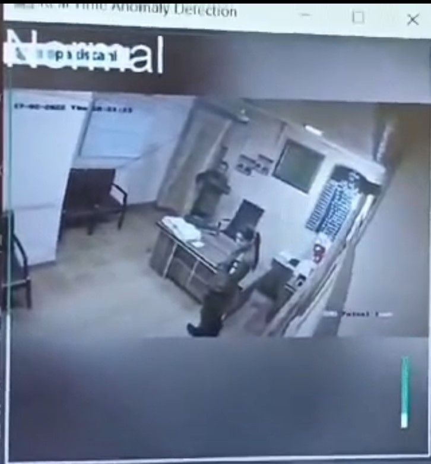

# Crowd Anomaly Detection System 🚨

An AI-based surveillance system designed to detect anomalous crowd behavior such as
fighting, abnormal gathering, person lying on the ground, and suspicious activities
using computer vision and deep learning.

This system can assist **police, armed forces, and smart city surveillance** by
automatically analyzing crowd behavior from CCTV footage.

---

## 🔍 Problem Statement
Manual monitoring of surveillance cameras is inefficient and prone to human error,
especially in crowded public areas. This project aims to automatically detect
abnormal crowd activities to improve public safety and response time.

---

## 🚀 Features
- Person detection using deep learning
- Crowd behavior and proximity analysis
- Detection of anomalous events such as:
  - Fighting
  - Person lying on the ground
  - Camera hiding or obstruction
- Designed for real-time surveillance use cases

---

## 🧠 System Overview
- Input: CCTV / surveillance video
- Detection: People detection and motion analysis
- Logic: Rule-based and behavior-based anomaly detection
- Output: Visual alerts on detected anomalous activities

---

## 🛠️ Tech Stack
- Python
- OpenCV
- YOLO (You Only Look Once)
- NumPy

---

## ▶️ How to Run the Project

```bash
pip install -r requirements.txt
python anomaly_detection.py
```
## 📸 Demo Results

<p align="center">
  
</p>

<p align="center">
  
</p>

<p align="center">
  
</p>

<p align="center">
  
</p>

